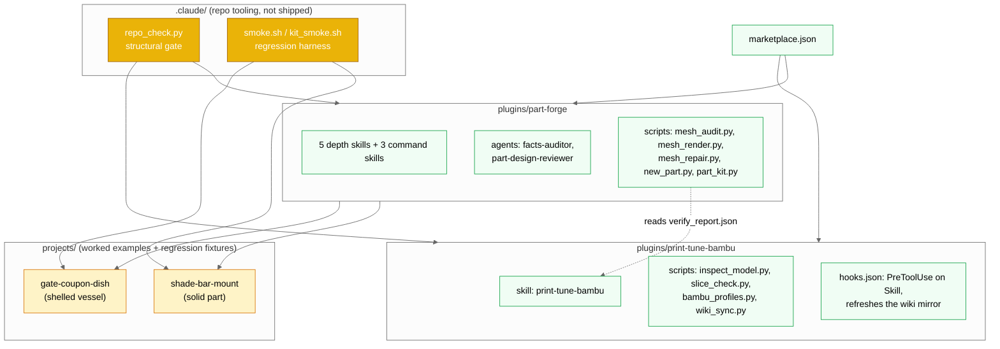
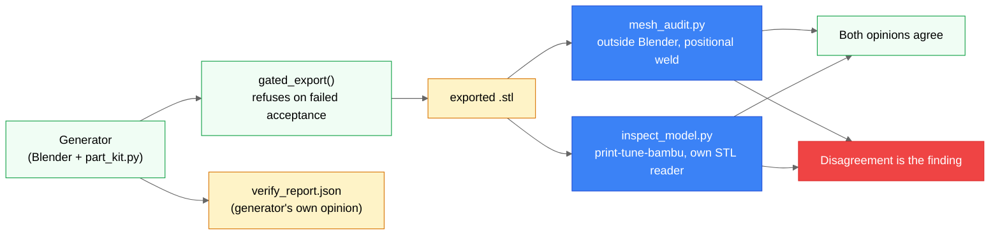
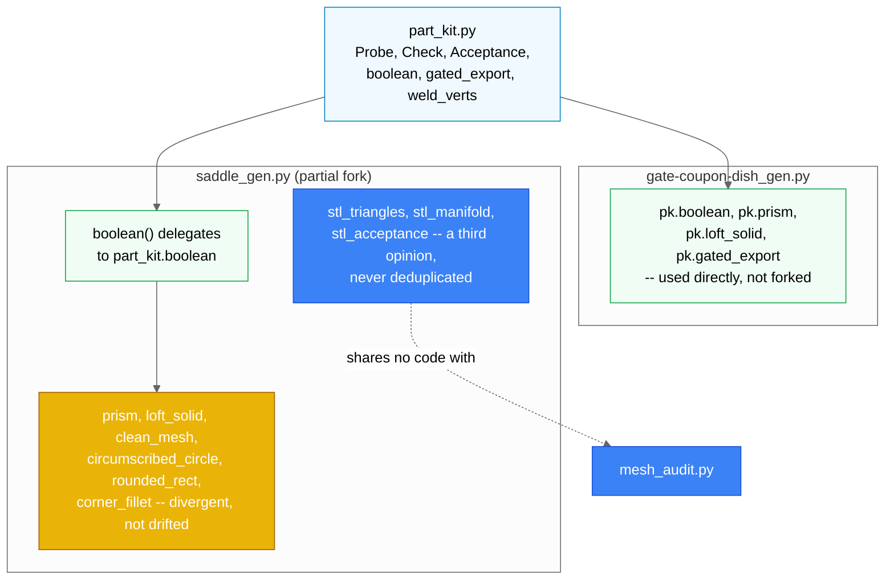

# Architecture Diagrams

> How part-forge and print-tune-bambu fit together, and why verification runs twice.

## Repository component map

What ships from this marketplace versus what only maintains it. `.claude/` is
never installed by either plugin — it exists to keep `repo_check.py` and the
smoke harnesses running against the two plugins and the two fixture projects.



Look at the dotted edge: `print-tune-bambu` reads `verify_report.json` when one
exists so it quotes the wall thickness already measured at the worst station
instead of re-deriving it. That is the only contract crossing the plugin
boundary in the current code.

## Independent verification of the exported mesh

The fact the whole repository is organized around: `mesh_audit.py` and
`inspect_model.py` read the same exported `.stl` bytes, independently, and
share no code. If they agree, that agreement is evidence. If they disagree,
the disagreement — not either report alone — is the finding.



Tier 0 of `mesh_audit.py` (STL parse, positional weld, manifold/winding,
Euler, signed volume, vertex digest) is standard-library-only on purpose, so
the gate can run inside Blender's bundled Python too. Tier 1 adds `trimesh`
for mass properties, wall thickness, and overhang area.

## part_kit.py: shared kernel, deliberate fork, independent verification

The two worked examples use the kit differently. `gate-coupon-dish_gen.py`
calls `part_kit.py` directly. `saddle_gen.py` is a **partial** fork: its
construction half routes `boolean()` through the kit so a kit regression can
move its pinned digest, but its geometry primitives are deliberately
divergent forks, and its verification functions never import `mesh_audit.py`
at all — that independence is the point, not an oversight.



`circumscribed_circle` is rotated 90 degrees relative to the kit's version so
a flat facet lands at the trough's rest point instead of a tessellation
valley — swapping any of the six forked primitives moves the pinned vertex
digest for no gain.

## The gen-part command, end to end

`/part-forge:gen-part` (`plugins/part-forge/skills/gen-part/SKILL.md`) is
where the two prior diagrams meet a single invocation: run the generator
behind its own gate, then re-audit the exported bytes with a tool that never
saw the generator run.

```mermaid
%%{init: {'theme':'neutral'}}%%
sequenceDiagram
    participant U as User
    participant SK as gen-part skill
    participant BL as Blender (generator script)
    participant FS as filesystem
    participant MA as mesh_audit.py

    U->>SK: /part-forge:gen-part path/to/part_gen.py
    SK->>BL: blender --background --python-exit-code 1 --python part_gen.py
    BL->>BL: build() + verify() against FACTS.md-derived parameters
    alt acceptance passes
        BL->>FS: gated_export() writes .stl + verify_report.json
    else acceptance fails
        BL->>FS: refuse export; delete any partial file
    end
    BL-->>SK: stdout report (measured vs. expected) + exit code
    SK->>MA: python3 mesh_audit.py exported.stl --gate --json
    MA-->>SK: independent audit (volume, body count, digest)
    SK->>SK: reconcile generator's numbers against the auditor's
    SK-->>U: verdict -- exported/refused, numbers vs. limits, any discrepancy
```

Precedence when a document and an executable check disagree about what is
true: `FACTS.md` beats `PROJECT.md` beats the generator beats the mesh. The
code is always the specification of record.

## Related

- [`CLAUDE.md`](../CLAUDE.md) — the idea this repository is built around.
- [`plugins/part-forge/README.md`](../plugins/part-forge/README.md) — the
  installed-user-facing description of the same components.
- [`.claude/skills/plugin-authoring/references/repo-map.md`](../.claude/skills/plugin-authoring/references/repo-map.md) —
  cross-plugin contracts and the current known-stale documentation list.
